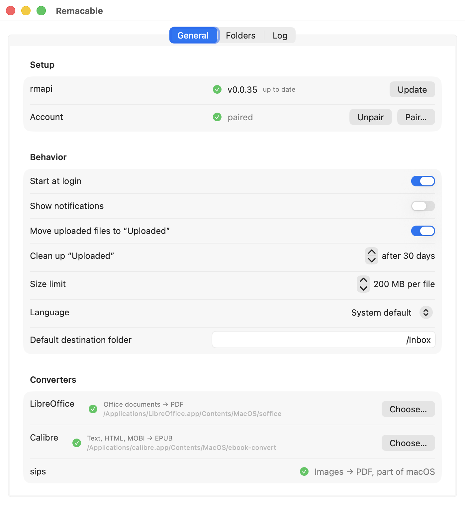
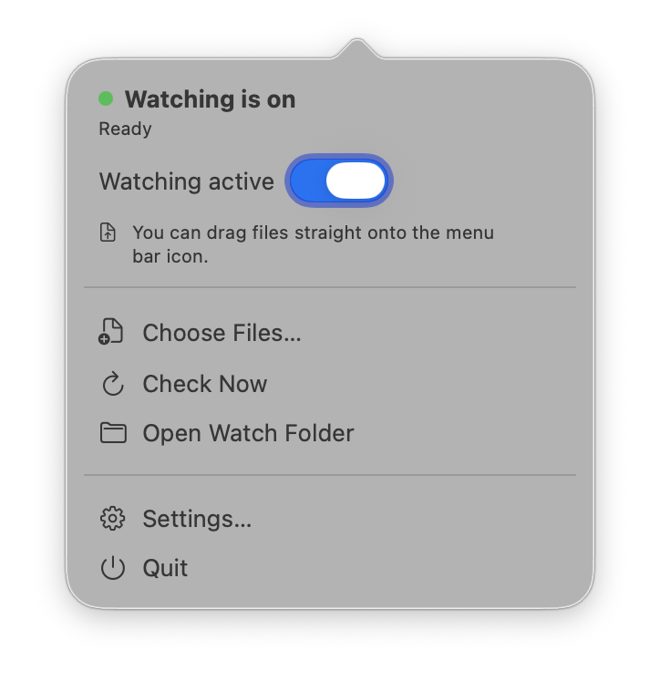
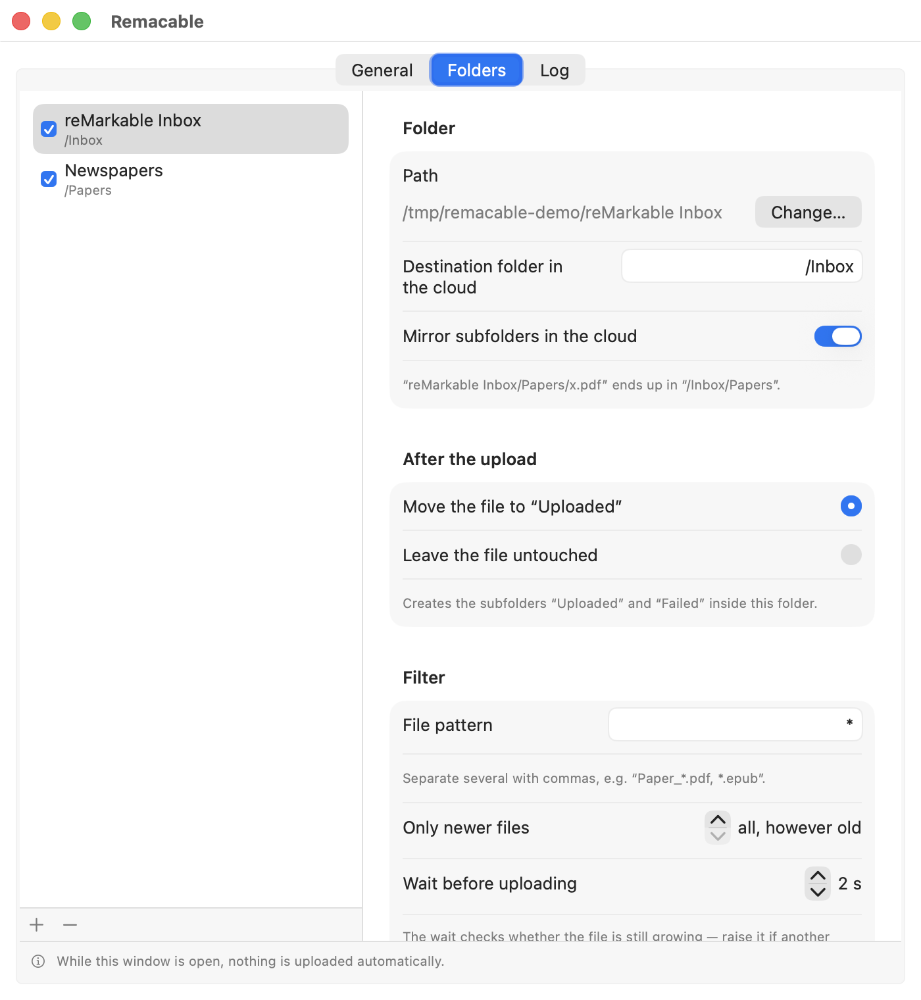
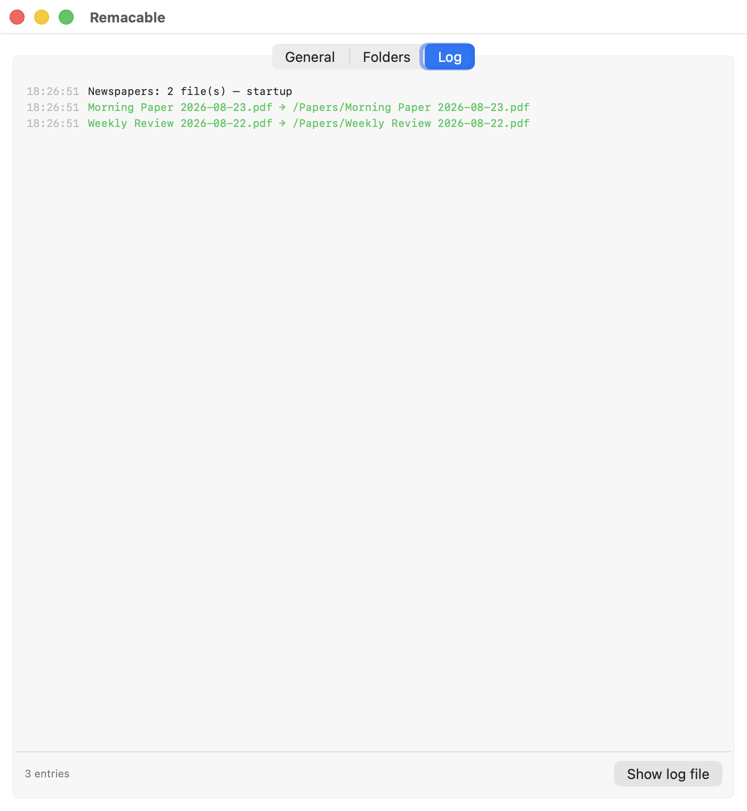

<p align="center">
  
</p>

<h1 align="center">Remacable</h1>

<p align="center">Send files to your reMarkable — no subscription, no root, no third-party service.</p>

<p align="center"><sub><a href="README.de.md">Deutsche Fassung</a></sub></p>

A small Mac app that lives in the menu bar. Drag a file onto the bird, or drop
it into a watched folder — it lands in your reMarkable cloud, and the tablet
picks it up on its next sync.

Your tablet stays untouched. The upload goes through the same interface the
official desktop app uses, so you need **no reMarkable Connect subscription**,
no tinkering with the device, and nothing travels through anyone else's server.

## What it's good for

* **Newspapers, newsletters, reports** land on the tablet by themselves, as
  soon as another program drops them into a folder.
* **Word, Excel, PowerPoint, images** no longer need converting by hand — the
  reMarkable only reads PDF and EPUB, and the app takes care of the rest.
* **Quickly sending something over**: drag the file onto the menu bar icon,
  done.

## Getting started

**1. Get the app.** Download it from
[Releases](https://github.com/noestreich/Remacable/releases), unzip, and move
`Remacable.app` to *Applications*. It is signed and notarized by Apple, so it
opens without a warning. (Or build it yourself, see below.)

**2. Install the helper.** The settings window opens on first launch. Under
**General → rmapi → Install**, the app fetches the upload tool itself — one
click, no terminal.

**3. Pair with your account.** Click **Pair…**. `my.remarkable.com` opens and
gives you an 8-character code, which you type into the field. That's it — the
app registers as an additional device, and you can revoke it in your reMarkable
account at any time.

<p align="center">
  
</p>

Both check marks green? Then you are set. Turn on **Start at login** so the app
comes back after a restart.

The interface speaks **English and German**. It follows your system language,
and you can also pick one explicitly under *Language*.

## Three ways to upload

| Way | How |
|---|---|
| **Drag & drop** | Drag the file onto the bird in the menu bar |
| **Watch folder** | Put the file into `~/reMarkable Inbox` — it goes up automatically |
| **Pick files** | Click *Choose Files…* in the menu |

<p align="center">
  
</p>

A short notification tells you when something is up. It appears on the tablet
as soon as that is switched on and on Wi-Fi.

## Watching folders

This is the real trick: add as many folders as you like, and everything that
lands in them goes up on its own. Handy for whatever another program drops
regularly — a daily newspaper download, a scanner folder, an export directory.

<p align="center">
  
</p>

Per folder you set:

| Setting | What it does |
|---|---|
| **Destination folder in the cloud** | Where it lands on the tablet, e.g. `/Papers` |
| **Mirror subfolders** | Recreates your subfolders on the tablet |
| **After the upload** | Leave the file alone **or** move it to `Uploaded/` |
| **File pattern** | Only certain files, e.g. `Paper_*.pdf` |
| **Only newer files** | Skip the back catalogue when switching a folder on |
| **Wait before uploading** | Guards against catching a file that is still being written |
| **Renaming** | Turns `BMP_2026_23082026` into `Berliner Morgenpost 2026-08-23` |

Two things that will save you trouble:

* **New folders start switched off.** Set everything up in peace; nothing
  happens until you tick the box. If files are already sitting there, the app
  asks whether those should go up too, or only whatever arrives from now on.
* **Other people's folders stay untouched.** By default nothing is moved,
  deleted, or created as a subfolder. An archive that another program maintains
  stays exactly as it is.

Under **Right now** you can always see what would go up — and if nothing is
pending, why not.

## What is going on, in the log

<p align="center">
  
</p>

## Formats

The reMarkable only reads **PDF** and **EPUB**. Everything else is converted
first, which needs a helper depending on the format:

| What you have | Becomes | Needs |
|---|---|---|
| PDF, EPUB | — | nothing |
| Word, Excel, PowerPoint, RTF, ODT, CSV | PDF | [LibreOffice](https://www.libreoffice.org) |
| Text, Markdown, HTML, MOBI, AZW3 | EPUB | [Calibre](https://calibre-ebook.com) |
| JPG, PNG, HEIC, TIFF | PDF | nothing (built into macOS) |

The *General* tab shows a green check mark for each helper it found. If one is
missing you simply cannot send those formats — everything else keeps working.

## Good to know

* The app only uploads **while it is running**. That is what *Start at login*
  is for.
* The reMarkable interface it uses is **unofficial**. Should uploads ever start
  failing, clicking **Update** next to *rmapi* usually helps; the app also
  shows when a newer version is available.
* Watching a folder inside *Downloads*, *Documents* or on the Desktop makes
  macOS ask for permission once.
* Nothing goes to a third party — only to reMarkable, with your own pairing.

## Building it yourself

Needs Xcode or the Command Line Tools:

```bash
./build.sh
```

Produces `Remacable.app`. If a "Developer ID Application" certificate is in
your keychain it is signed with it — hardened runtime and secure timestamp
included — otherwise ad-hoc.

For a release, Apple notarization comes on top. The credentials are stored in
the keychain once:

```bash
xcrun notarytool store-credentials "Remacable" --apple-id "YOUR-APPLE-ID" --team-id YOUR-TEAM-ID
ditto -c -k --keepParent --sequesterRsrc Remacable.app Remacable.zip
xcrun notarytool submit Remacable.zip --keychain-profile "Remacable" --wait
xcrun stapler staple Remacable.app   # then package again
```

Interface strings live in the source in English; the German version sits in
`Resources/de.lproj/Localizable.strings`. Another language needs only one more
`.lproj` file — `build.sh` picks it up automatically.

The menu bar symbol is generated from a single-colour template; the tool trims
the margin and scales it to height:

```bash
swift Tools/make-menubar-icon.swift template.png Resources/MenuBarIcon.png 44
```

Code layout: `Sources/Remacable/` — `UploadEngine` collects, converts and
uploads, `Watching` hooks into FSEvents, `RmapiClient` talks to the cloud, the
rest is interface. `swift test` runs the unit tests.

## Thanks

The heart of this is not mine: **[ddvk/rmapi](https://github.com/ddvk/rmapi)**
speaks the reMarkable cloud API and does the actual uploading. Without that
project Remacable would not exist — it downloads rmapi during setup, keeps it
current, and wraps an interface around it.

rmapi goes back to [juruen/rmapi](https://github.com/juruen/rmapi); ddvk's fork
maintains the newer sync protocol. Both are AGPL-3.0 and are invoked unchanged
as a separate program, not linked in.

Thanks to [@jimmystridh](https://github.com/jimmystridh) for early
contributions: releasing the settings window on close, handling missing and
colliding cloud folders, and the idea of an explicit language selection with
forward-compatible settings decoding.

reMarkable itself has nothing to do with any of this — the interface used here
is not officially documented.
