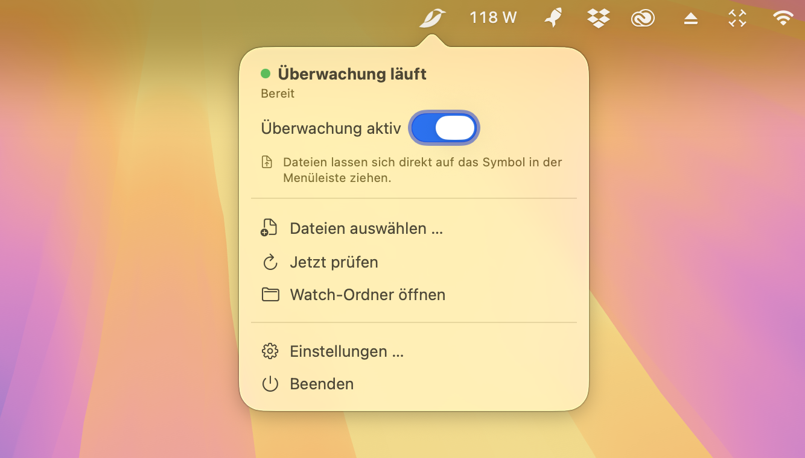
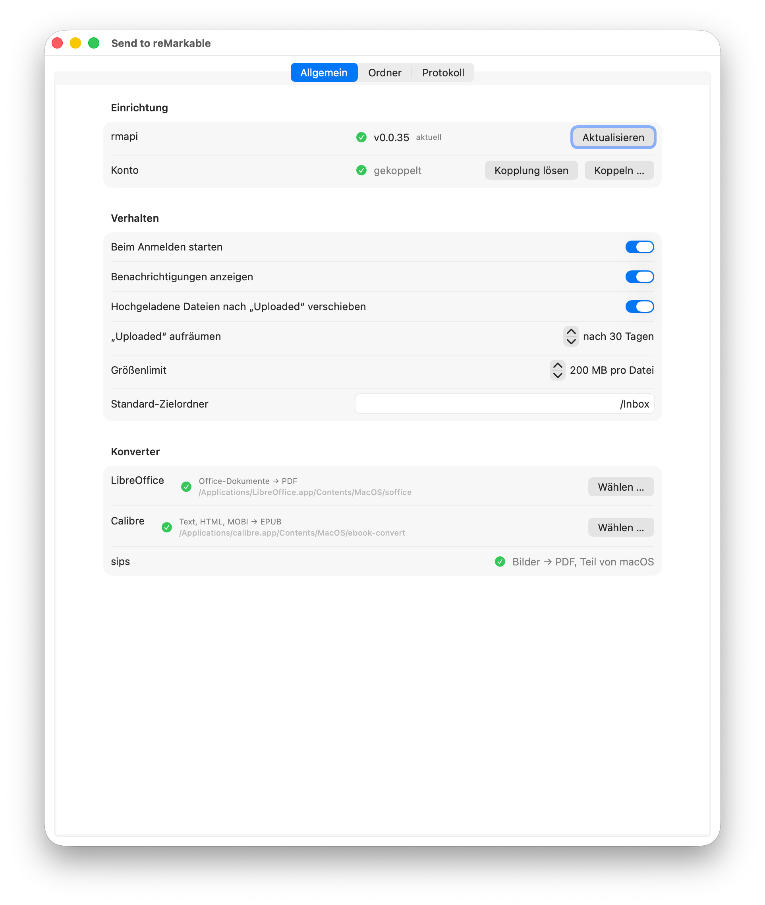
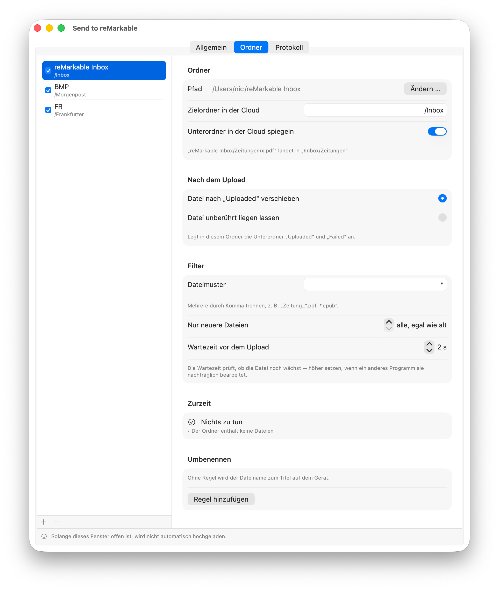
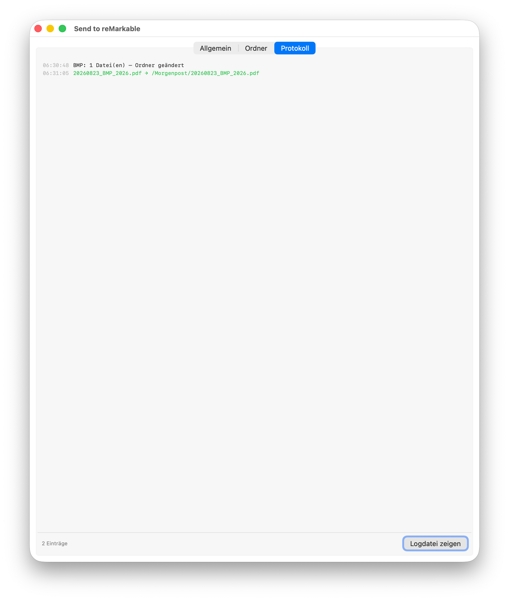

<p align="center">
  
</p>

<h1 align="center">Remacable</h1>

<p align="center">Dateien aufs reMarkable schicken — ohne Abo, ohne Root, ohne fremden Dienst.</p>

<p align="center">
  
</p>

Eine kleine Mac-App, die in der Menüleiste sitzt. Zieh eine Datei auf den Vogel
oder leg sie in einen überwachten Ordner — sie landet in deiner
reMarkable-Cloud, und das Tablet holt sie sich beim nächsten Sync.

Das Tablet bleibt unangetastet: Der Upload passiert über dieselbe Schnittstelle,
die auch die offizielle Desktop-App benutzt. Du brauchst **kein reMarkable
Connect**, keinen Bastel-Zugriff aufs Gerät und schickst nichts über fremde
Server.

Die Oberfläche gibt es auf **Deutsch und Englisch** — sie richtet sich nach der
Systemsprache.

## Wofür das gut ist

* **Zeitung, Newsletter, Berichte** landen automatisch auf dem Tablet, sobald
  sie ein anderes Programm in einen Ordner legt.
* **Word, Excel, PowerPoint, Bilder** musst du nicht mehr selbst umwandeln —
  das reMarkable kann nur PDF und EPUB, die App konvertiert automatisch.
* **Schnell mal was rüberschieben**: Datei auf das Symbol in der Menüleiste
  ziehen, fertig.

## Installation

**1. App holen.** Die fertige App aus den
[Releases](https://github.com/noestreich/Remacable/releases) laden, entpacken
und nach *Programme* ziehen. Sie ist signiert und von Apple beurkundet, startet
also ohne Warnmeldung. (Oder selbst bauen, siehe ganz unten.)

**2. Hilfsprogramm installieren.** Beim ersten Start öffnet sich das
Einstellungsfenster. Unter **Allgemein → rmapi → Installieren** holt sich die
App das Upload-Werkzeug selbst — ein Klick, nichts im Terminal.

**3. Mit deinem Konto koppeln.** Auf **Koppeln …** klicken. Es öffnet sich
`my.remarkable.com`, dort bekommst du einen 8-stelligen Code, den du ins Feld
einträgst. Das war's — die App meldet sich als zusätzliches Gerät an, das du in
deinem reMarkable-Konto jederzeit wieder entfernen kannst.

<p align="center">
  
</p>

Beide Häkchen sind grün? Dann läuft es. Aktivier noch **Beim Anmelden starten**,
damit die App nach einem Neustart von selbst wieder da ist.

## Drei Wege, etwas hochzuladen

| Weg | So geht's |
|---|---|
| **Drag & Drop** | Datei auf den Vogel in der Menüleiste ziehen |
| **Watch-Ordner** | Datei in `~/reMarkable Inbox` legen — geht automatisch hoch |
| **Auswählen** | Im Menü auf *Dateien auswählen …* klicken |

Nach dem Upload bekommst du eine kurze Mitteilung. Auf dem Tablet taucht das
Dokument auf, sobald es an und im WLAN ist.

## Ordner überwachen

Das ist der eigentliche Kniff: Du kannst beliebig viele Ordner eintragen, und
alles, was dort landet, geht von allein hoch. Praktisch für alles, was ein
anderes Programm regelmäßig ablegt — der tägliche Zeitungs-Download zum
Beispiel.

<p align="center">
  
</p>

Pro Ordner stellst du ein:

| Einstellung | Was sie macht |
|---|---|
| **Zielordner in der Cloud** | Wo das Dokument auf dem Tablet landet, z. B. `/Zeitungen` |
| **Unterordner spiegeln** | Legt Unterordner auf dem Tablet genauso an |
| **Nach dem Upload** | Datei liegen lassen **oder** nach `Uploaded/` wegräumen |
| **Dateimuster** | Nur bestimmte Dateien, z. B. `Zeitung_*.pdf` |
| **Nur neuere Dateien** | Altbestand beim Einschalten überspringen |
| **Wartezeit** | Schutz davor, eine noch nicht fertig geschriebene Datei zu erwischen |
| **Umbenennen** | Aus `BMP_2026_23082026` wird `Berliner Morgenpost 2026-08-23` |

Zwei Dinge, die dir Ärger ersparen:

* **Neue Ordner sind erst mal aus.** Du kannst in Ruhe alles einstellen; erst
  wenn du das Häkchen setzt, passiert etwas. Liegen dann schon Dateien im
  Ordner, fragt die App, ob die auch hochsollen oder nur alles Künftige.
* **Fremde Ordner bleiben unberührt.** Voreingestellt wird nichts verschoben,
  gelöscht oder an Unterordnern angelegt. Ein Archiv, das ein anderes Programm
  verwaltet, bleibt so, wie es ist.

Unter **Zurzeit** steht jederzeit, was gerade hochginge — und wenn nichts
ansteht, warum nicht.

## Was mitläuft, siehst du im Protokoll

<p align="center">
  
</p>

## Formate

Das reMarkable kann nur **PDF** und **EPUB**. Alles andere wandelt die App
vorher um, dafür braucht sie je nach Format ein Hilfsprogramm:

| Was du hast | Wird zu | Braucht |
|---|---|---|
| PDF, EPUB | — | nichts |
| Word, Excel, PowerPoint, RTF, ODT, CSV | PDF | [LibreOffice](https://www.libreoffice.org) |
| Text, Markdown, HTML, MOBI, AZW3 | EPUB | [Calibre](https://calibre-ebook.com) |
| JPG, PNG, HEIC, TIFF | PDF | nichts (macOS-Bordmittel) |

Im Reiter *Allgemein* siehst du mit einem grünen Haken, welche Hilfsprogramme
gefunden wurden. Fehlt eines, kannst du die betreffenden Formate einfach nicht
schicken — alles andere geht weiter.

## Gut zu wissen

* Die App lädt nur hoch, **solange sie läuft**. Deshalb „Beim Anmelden starten"
  aktivieren.
* Die verwendete reMarkable-Schnittstelle ist **inoffiziell**. Sollten Uploads
  irgendwann scheitern, hilft meist ein Klick auf **Aktualisieren** bei *rmapi*;
  daneben steht immer, ob eine neuere Fassung verfügbar ist.
* Überwachst du einen Ordner in *Downloads*, *Dokumente* oder auf dem
  Schreibtisch, fragt macOS einmalig nach Erlaubnis.
* Es wird nichts an fremde Server geschickt: nur zu reMarkable, mit deiner
  eigenen Kopplung.

## Selbst bauen

Braucht Xcode oder die Command Line Tools:

```bash
./build.sh
```

Erzeugt `Remacable.app`. Liegt ein „Developer ID Application"-Zertifikat
im Schlüsselbund, wird damit signiert — mit Hardened Runtime und sicherem
Zeitstempel —, sonst ad-hoc.

Für eine Veröffentlichung kommt die Beurkundung durch Apple dazu. Die
Zugangsdaten legt man einmalig im Schlüsselbund ab:

```bash
xcrun notarytool store-credentials "Remacable" --apple-id "DEINE-APPLE-ID" --team-id DEINE-TEAM-ID
ditto -c -k --keepParent --sequesterRsrc Remacable.app Remacable.zip
xcrun notarytool submit Remacable.zip --keychain-profile "Remacable" --wait
xcrun stapler staple Remacable.app   # danach neu paketieren
```

Das Symbol für die Menüleiste entsteht aus einer einfarbigen Vorlage — das
Werkzeug schneidet den Rand weg und skaliert auf Höhe:

```bash
swift Tools/make-menubar-icon.swift vorlage.png Resources/MenuBarIcon.png 44
```

Die Oberflächentexte stehen als englische Zeichenketten im Quelltext; die
deutsche Fassung liegt in `Resources/de.lproj/Localizable.strings`. Eine weitere
Sprache braucht nur eine zusätzliche `.lproj`-Datei, `build.sh` nimmt sie
automatisch mit.

Aufbau des Codes: `Sources/Remacable/` — `UploadEngine` sammelt ein,
konvertiert und lädt hoch, `Watching` hängt an FSEvents, `RmapiClient` spricht
mit der Cloud, der Rest ist Oberfläche.

## Dank

Das Herzstück ist nicht von mir: **[ddvk/rmapi](https://github.com/ddvk/rmapi)**
spricht die reMarkable-Cloud-API und erledigt den eigentlichen Upload. Ohne
dieses Projekt gäbe es Remacable nicht — es lädt rmapi bei der Einrichtung
herunter, hält es aktuell und baut eine Oberfläche drumherum.

rmapi geht zurück auf [juruen/rmapi](https://github.com/juruen/rmapi); die
Fassung von ddvk pflegt das neuere Sync-Protokoll weiter. Beide stehen unter
der AGPL-3.0 und werden von Remacable unverändert als eigenständiges Programm
aufgerufen, nicht eingebunden.

reMarkable selbst ist an alldem unbeteiligt: Die verwendete Schnittstelle ist
nicht offiziell dokumentiert.
